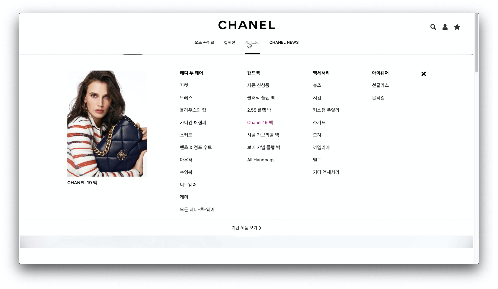

## No.4 프로젝트 Front-End
- 대표적인 명품 브랜드 중 우아함고 고급스러움의 대명사인 샤넬(Chanel)의 한국 공식 홈페이지를 클로닝하는 프로젝트
- 샤넬의 유명한 향수 이름 No.5(넘버 파이브)를 모티브로 하여 프로젝트명을 명명함.
- [공식 샤넬 홈페이지 링크](https://www.chanel.com/ko_KR/fashion.html)

## 개발 인원 및 기간
- 개발 인원: 프론트엔드 3명, 백엔드 3명
- 개발 기간: 2020/06/22 - 2020/07/03 (2주)
- [백엔드 github 링크](https://github.com/wecode-bootcamp-korea/9-No.4-backend)

## 목적
샤넬의 공식 홈페이지는 전체적으로 미니멀한 디자인으로 이루어져 있기에 언뜻 보면 별다른 기능이나 효과가 눈에 띄지 않지만, 페이지를 하나 하나 살펴보면 디테일한 효과나 기능에 공을 많이 들였음을 알 수 있다. 여타 홈페이지에서는 보기 드문 효과들도 있기에 이번 기회를 통해 경험해본다면 여타 프론트개발자들과 차별화 될 수 있다는 생각으로 선정하였다.

## 데모 영상(이미지 클릭)

## 적용 기술
### Front-End
- React.js
- Sass
- React-router-dom
- React-slick
- Fontawesome

### Back-End
- Python
- Django
- Beautifulsoup
- Selenium
- Bcrypt
- MySQL

### 커뮤니케이션 및 버전관리
- Postman
- Slack
- Trello
- Git / Github

## 구현 기능
- 회원가입 / 로그인(POST, GET)
- 전체 상품 API를 통한 상품리스트 렌더링(GET)
- 상품 상세페이지 이동 시 해당 상품 API를 통한 상품 정보 렌더링(GET)
- 특정 상품의 별 아이콘 클릭 시 위시리스트 추가(POST)
- 위시리스트에 추가된 상품의 별 아이콘 다시 클릭 시 위시리스트 제거(POST)

## 미구현 기능
- 스크롤이벤트
- 페이지네이션
- 위시리스트 등록 상품 상태유지